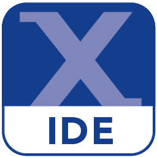

# O mnie 👋

:open_book: Jestem studentem trzeciego roku Informatyki Stosowanej na specializacji Informatyka w systemach sterowania  
:brain: Jestem zafascynowany Machine Learning'iem  
:dart: Cel zostać Embedded Engineer'em  
:sunny: Jedna kompilacja dziennie!  

# Technologie

 </a>
 </a>
 </a>
 </a>
 </a>
 </a>
 </a>